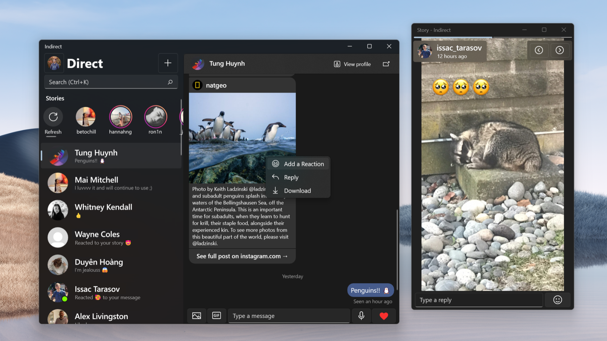

# Indirect

> [!IMPORTANT]  
> Due to the high barrier for development, Indirect is no longer maintained and has been pulled from the Microsoft Store. Install the [sideload package](https://github.com/huynhsontung/Indirect/releases/download/v2.9.0/Indirect_2.9.0.0_Test.zip) at your own risk.

An unofficial UWP Instagram Direct Message client for Windows 10, built with the goal of providing Instagram messaging capability for Windows devices while maintaining Windows 10 design language.

## References
Some code used in this project is heavily referenced from the following sources:
- [InstaSharper](https://github.com/a-legotin/InstaSharper) by [a-legotin](https://github.com/a-legotin/)
- [InstagramApiSharp](https://github.com/ramtinak/InstagramApiSharp) by [ramtinak](https://github.com/ramtinak/)

## Legal
This project is in no way affiliated with, authorized, maintained, sponsored or endorsed by Instagram or any of its affiliates or subsidiaries.
